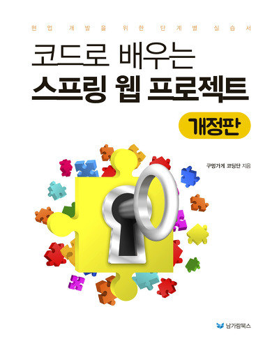
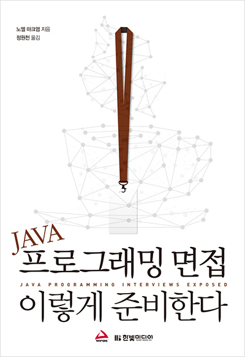
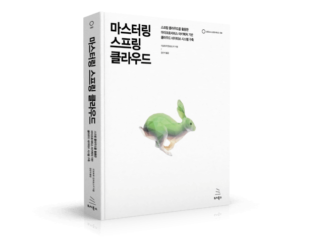
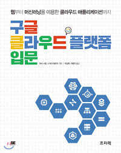
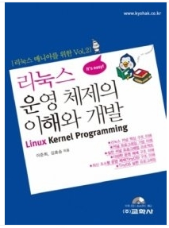
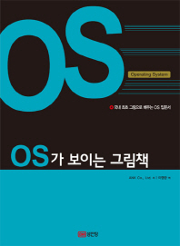
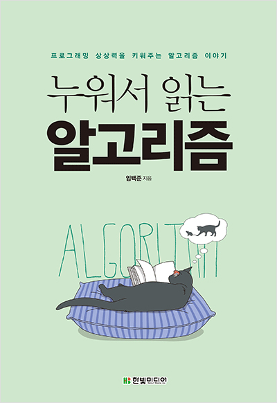
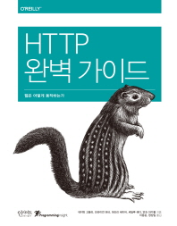

# STUDY
>공부한 책 및 자료들을 정리한 공간입니다.
>
>제목을 클릭 하시면 정리한 상세 페이지로 이동할 수 있습니다.

# 1. [Algorithm](Algorithm)

# 2. [Interview - 면접정리](Interview)

# 3. [개발자에게 좋은 글 / 정보](knowledge)

# 4. Books - 책정리
- 책 없이 그냥 보시면 의미가 없습니다.
<table text-align="center">
 <tr>
  <td width="30%">
   
   
   - [자바 네트워크 소녀 Netty](index/netty.md)  
   
   </td>
 </tr>
<tr>
<td width="30%">
 

- [코드로 배우는 스프링 웹 프젝](index/guguSpring.md)  

</td>
<td width="30%">

- JAVA 프로그래밍 면접 이렇게 준비한다  
 
읽는중

</td>
<td width="30%">
 

- 마스터링 스프링 클라우드  
 
 읽는중
 
</td>
</tr>
<tr>
<td width="30%">
 

- 구글 클라우드 플랫폼 입문   
 
</td>
<td width="30%">

- 리눅스 운영체제의 이해와 개발  
 
</td>
<td width="30%">
 

- [OS가 보이는 그림책](index/OS_PictureBook.md)  

</td>
</tr>
<tr>
<td width="30%">

- [그림으로 배우는 HTTP & Network Basic](index/pictureHTTPbasic.md)
업데이트 예정
</td>
<td width="30%">

- [누워서 읽는 알고리즘](http://1ilsang.blog.me/221310043150)
읽는중
</td>
<td width="30%">

- [HTTP 완벽 가이드](index/HttpPerfect.md)

</td>
</tr>
<tr>
<td width="30%" >

<a href="https://github.com/1ilsang/TypeScript-Quick-Start"></img></a>
- [TypeScript 퀵 스타트 - 정진욱 (루비페이퍼)](https://github.com/1ilsang/TypeScript-Quick-Start)
 
</td>

<td width="30%">

<a href="index/TcpIpPictureBook.md"></img></a>
- [Tcp/Ip가 보이는 그림책](index/TcpIpPictureBook.md)

</td>

<td width="30%" >

<a href="index/LearningHTTP2.md"></img></a>
- [러닝 Http/2](index/LearningHTTP2.md)
공부중...
</td>
</tr>

<tr>
<td width="30%" >

<a href="https://github.com/1ilsang/The-Majesty-Of-Vue.js2"></img></a>
- [The Majesty of Vue.js 2](https://github.com/1ilsang/The-Majesty-Of-Vue.js2)
</td>

<td width="30%">

<a href="https://github.com/1ilsang/Vue.js-Quick-Start"></img></a>
- [Vue 퀵 스타트(Vue.js quick start) - 원형섭 (루비페이퍼)](https://github.com/1ilsang/Vue.js-Quick-Start)
</td>

<td width="30%" >

<a href="https://github.com/1ilsang/Functional-JS-inflearn"></img></a>
- [Inflearn - 자바스크립트로 알아보는 함수형 프로그래밍](https://github.com/1ilsang/Functional-JS-inflearn)
</td>
</tr>
<tr>
<td width="30%" >

<a href="https://github.com/1ilsang/Learning-Javascript"></img></a>
- [러닝 자바스크립트 - 이선 브라운 (한빛미디어17)](https://github.com/1ilsang/Learning-Javascript)

</td>

<td width="30%">

<a href="index/insideJS.md"></img></a>
- [인사이드 자바스크립트 - 송형주, 고현준 (한빛미디어14)](index/insideJS.md)
</td>
<td width="30%">

<a href="https://github.com/1ilsang/17_study_compilation/tree/master/nodejsBoardList"></img></a>
- [Do it! Node.js 프로그래밍 - 정재곤 (이지스퍼블리싱17)](https://github.com/1ilsang/17_study_compilation/tree/master/nodejsBoardList)
</td>
</tr>

<tr>
<td width="30%">

<a href="index/DesignPattern.md"></img></a>
- [자바 객체지향 디자인 패턴 - 정인상, 채흥석 (한빛미디어14)](index/DesignPattern.md)
</td>
<td width="30%">

<a href="index/HotBloodC.md"></img></a>
- [윤성우 열혈 C 프로그래밍 - 윤성우 (오렌지미디어10)](index/HotBloodC.md)
</td>
<td width="30%">

<a href="http://1ilsang.blog.me/220795346040"></img></a>
- [초보자를 위한 C 언어 300제 - 김은철 (정보문화사13)](http://1ilsang.blog.me/220795346040)
</td>
</tr>

<tr>
<td width="30%">

<a href="http://1ilsang.blog.me/220952278705"></img></a>
- [자바의 정석 - 남궁성 (도우출판16)](http://1ilsang.blog.me/220952278705)
</td>
<td width="30%">

<a href="https://github.com/1ilsang/17_study_compilation/tree/master/FirstServlet"></img></a>
- [처음 해보는 Servlet & JSP 웹 프로그래밍 - 오정임 (루비페이퍼17)](https://github.com/1ilsang/17_study_compilation/tree/master/FirstServlet)
</td>
<td width="30%">

<a href="https://github.com/1ilsang/17_study_compilation/tree/master/Spring_prt"></img></a>
- [스프링 퀵 스타트(Spring quick start) - 최규태 (루비페이퍼17)](https://github.com/1ilsang/17_study_compilation/tree/master/Spring_prt)
</td>
</tr>

<tr>
<td width="30%">

- [유닉스 이론과 실습 - 운소정,이종원 (한빛미디어17)](index/UNIXtheory.md)
</td>
</tr>
</table>
