# STUDY
>공부한 책 및 자료들을 정리한 공간입니다.
>
>제목을 클릭 하시면 정리한 상세 페이지로 이동할 수 있습니다. 
>
>더 많이 공부해야지~~

<table text-align="center">
<tr>
<td width="30%">

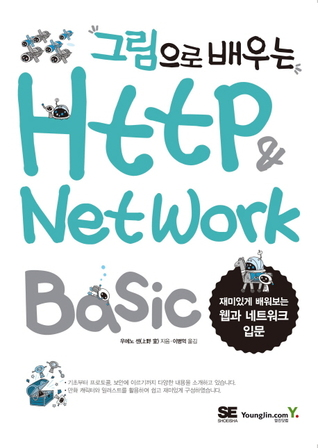

- [그림으로 배우는 HTTP & Network Basic](http://1ilsang.blog.me/221257888202)
업데이트 예정
</td>
<td width="30%">

</td>
<td width="30%">

</td>
</tr>
<tr>
<td width="30%" >

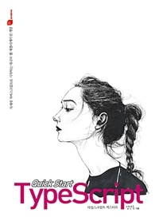</img>
- [TypeScript]()
공부중...
</td>

<td width="30%">

<a href="index/TcpIpPictureBook.md">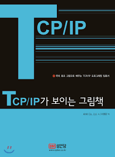</img></a>
- [Tcp/Ip가 보이는 그림책](index/TcpIpPictureBook.md)
공부중...
</td>

<td width="30%" >

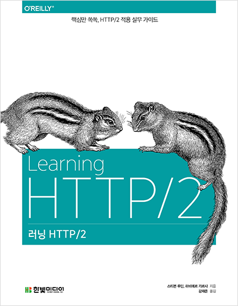</img>
- [러닝 Http/2]()
공부중...
</td>
</tr>

<tr>
<td width="30%" >

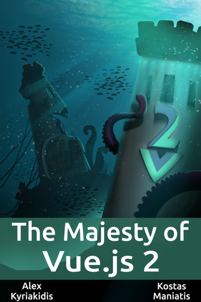</img>
- [The Majesty of Vue.js 2](https://github.com/1ilsang/The-Majesty-Of-Vue.js2)
</td>

<td width="30%">

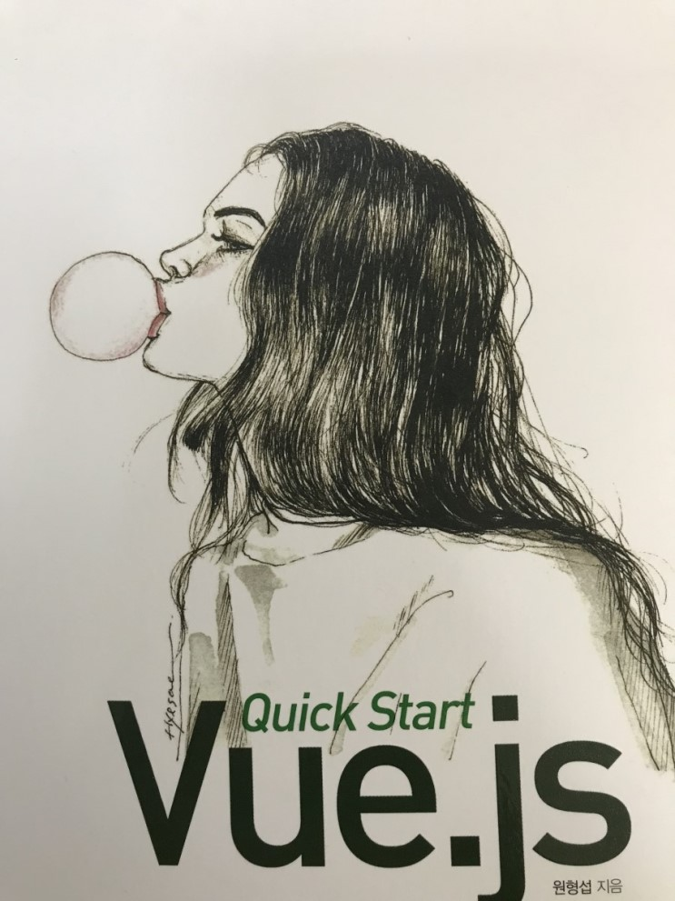</img>
- [Vue 퀵 스타트(Vue.js quick start) - 원형섭 (루비페이퍼)](https://github.com/1ilsang/Vue.js-Quick-Start)
</td>

<td width="30%" >

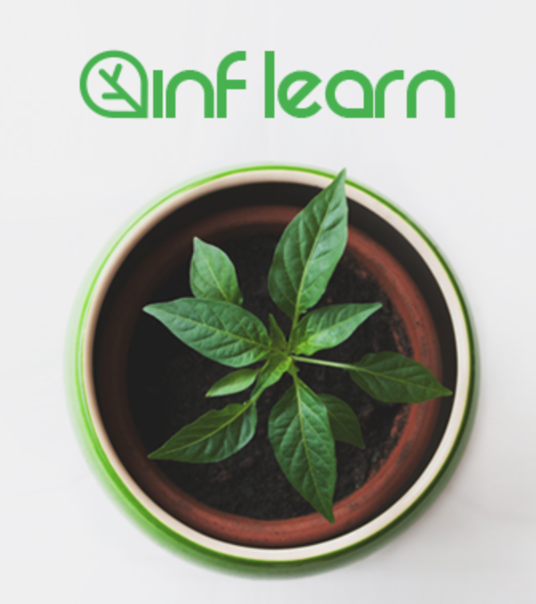</img>
- [Inflearn - 자바스크립트로 알아보는 함수형 프로그래밍](https://github.com/1ilsang/Functional-JS-inflearn)
</td>
</tr>
<tr>
<td width="30%" >

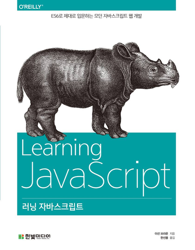</img>
- [러닝 자바스크립트 - 이선 브라운 (한빛미디어17)](https://github.com/1ilsang/Learning-Javascript)

</td>

<td width="30%">

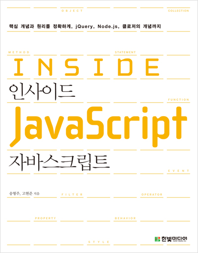</img>
- [인사이드 자바스크립트 - 송형주, 고현준 (한빛미디어14)](http://1ilsang.blog.me/221173491878)
</td>
<td width="30%">

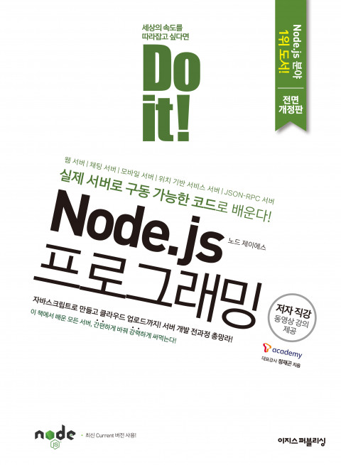</img>
- [Do it! Node.js 프로그래밍 - 정재곤 (이지스퍼블리싱17)](https://github.com/1ilsang/17_study_compilation/tree/master/nodejsBoardList)
</td>
</tr>

<tr>
<td width="30%">

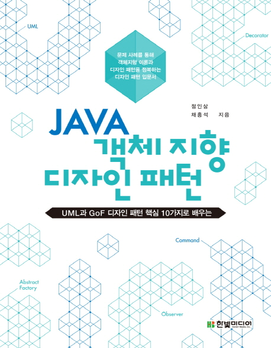</img>
- [자바 객체지향 디자인 패턴 - 정인상, 채흥석 (한빛미디어14)](index/DesignPattern.md)
</td>
<td width="30%">

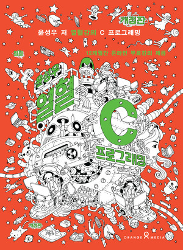</img>
- [윤성우 열혈 C 프로그래밍 - 윤성우 (오렌지미디어10)](http://1ilsang.blog.me/220721246081)
</td>
<td width="30%">

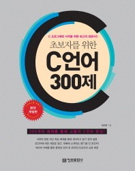</img>
- [초보자를 위한 C 언어 300제 - 김은철 (정보문화사13)](http://1ilsang.blog.me/220795346040)
</td>
</tr>

<tr>
<td width="30%">

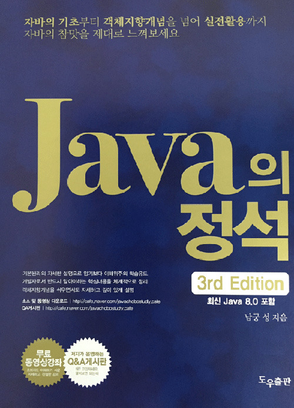</img>
- [자바의 정석 - 남궁성 (도우출판16)](http://1ilsang.blog.me/220952278705)
</td>
<td width="30%">

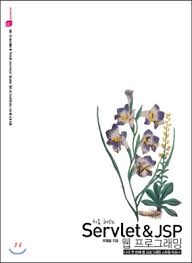</img>
- [처음 해보는 Servlet & JSP 웹 프로그래밍 - 오정임 (루비페이퍼17)](https://github.com/1ilsang/17_study_compilation/tree/master/FirstServlet)
</td>
<td width="30%">

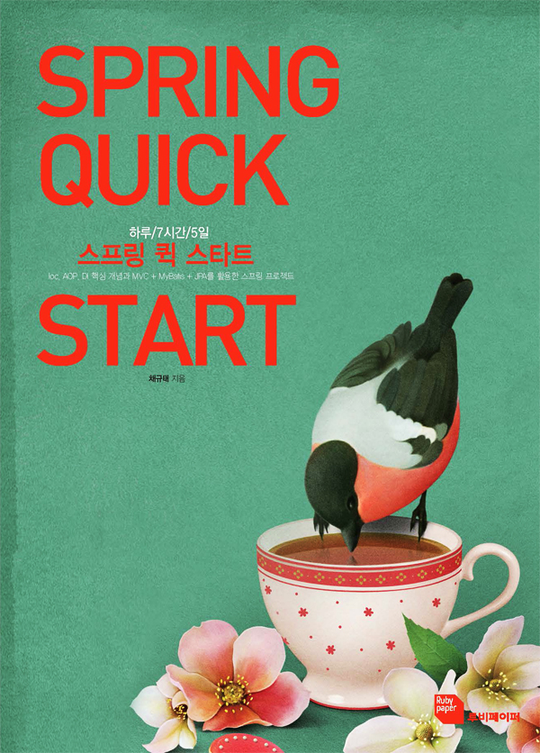</img>
- [스프링 퀵 스타트(Spring quick start) - 최규태 (루비페이퍼17)](https://github.com/1ilsang/17_study_compilation/tree/master/Spring_prt)
</td>
</tr>

<tr>
<td width="30%">

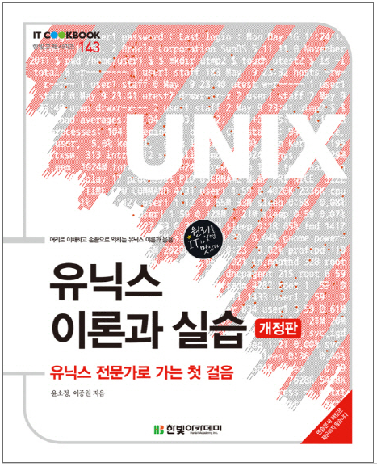

- [유닉스 이론과 실습 - 운소정,이종원 (한빛미디어17)](http://1ilsang.blog.me/220565472888)
</td>
</tr>
</table>